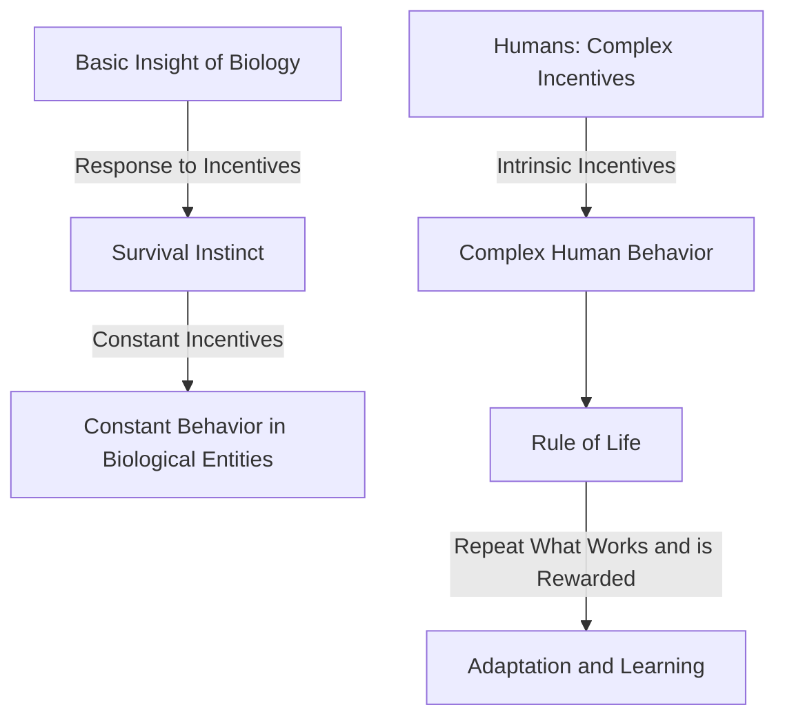

# [Incentives](https://en.wikipedia.org/wiki/Incentive)

- The basic insight of biology suggests that all creatures respond to incentives to keep themselves alive.
- Constant incentives will tend to cause a biological entity to have constant behavior. 
- Humans are are particularly great examples of the incentive-driven nature of biology but humans are complicated in that their incentives can be hidden or intangible. 
- The rule of life is to repeat what works and has been rewarded.

!!! example "Example of Human Instrinsic Incentive"
    MK discovers that dedicating more time to studying significantly improves their grades. The initial incentive is the desire for better grades, perhaps motivated by personal satisfaction, parental approval, or future career opportunities?