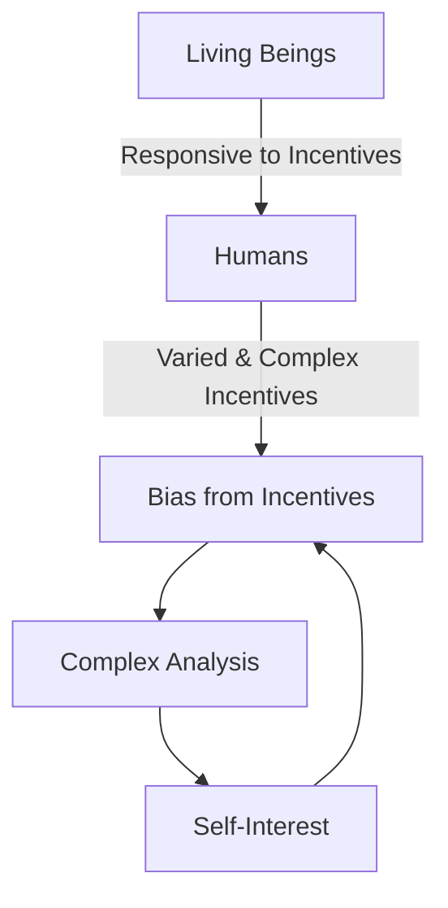

# [Bias From Incentives]()

- Living things are highly responsive to incentives, humans have perhaps the most varied and hardest to understand set of incentives in the animal kingdom. 
- This causes us to distort our thinking when it is in our own interest to do so. 

!!! example "Example of Bias From Incentive" 
    A salesman truly believing that his product will improve the lives of its users. It’s not merely convenient that he sells the product; the fact of his selling the product causes a very real bias in his own thinking.