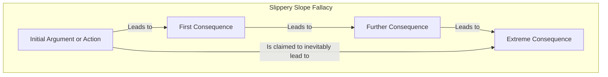

# [Slippery Slope](https://en.wikipedia.org/wiki/Slippery_slope)

- Saying that if we allow A to happen, then Z will eventually happen too, therefore A should not happen.
- The problem with this reasoning is that it avoids engaging with the issue at hand, and instead shifts attention to extreme hypotheticals. Because no proof is presented to show that such extreme hypotheticals will in fact occur, this fallacy has the form of an appeal to emotion fallacy by leveraging fear. 
- In effect the argument at hand is unfairly tainted by unsubstantiated conjecture.

!!! Example "Example of Slipper Slope"
    "Caleb Closet Gay Boi" asserts that if we allow same-sex couples to marry, then the next thing we know we'll be allowing people to marry their parents, their cars and even monkeys.

