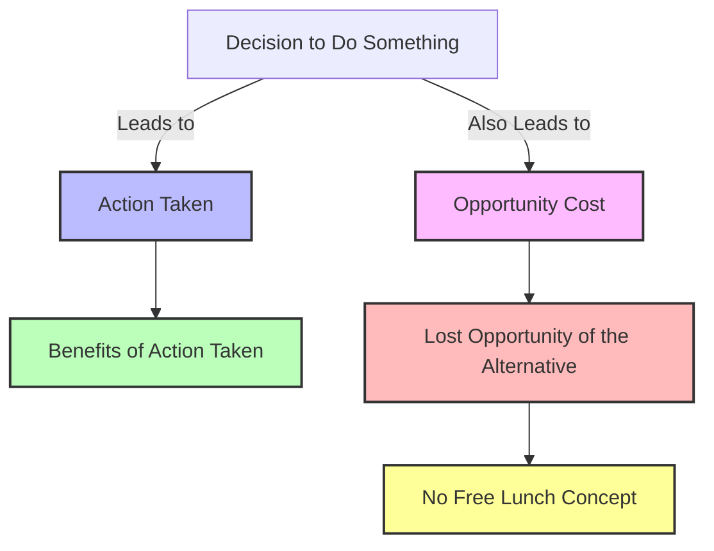

# [Opportunity Costs](https://www.investopedia.com/terms/o/opportunitycost.asp)

- Doing one thing means not being able to do another. 
- Our reality is a world of trade-offs, and the concept of opportunity cost rules all. 
- Can be summarized as “there is no such thing as a free lunch".

!!! example "Example of Opportunity Costs"
    Deciding to spend all your free time checking girls out on Instagram means the opportunity cost is missing out on meeting potential partners in the real world