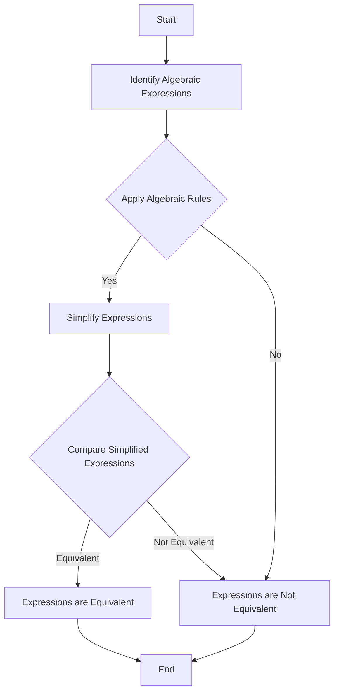

# [Algebraic Equivalence](https://en.wikipedia.org/wiki/Adequate_equivalence_relation)



- The introduction of algebra allowed us to demonstrate mathematically and abstractly that two seemingly different things could be the same. 
- By manipulating symbols, we can demonstrate equivalence or inequivalence, the use of which led humanity to untold engineering and technical abilities. 
- Knowing at least the basics of algebra can allow us to understand a variety of important results.

!!! example "Example of Algebraic Equivalence"
    - Imagine a car that travels at a certain speed, and you want to find out how long it takes to cover a certain distance. 
    - Let's say the car travels at a constant speed of "s" miles per hour, and you want to find the time it takes to cover a distance "d" miles.
    - We can represent this using algebra, you can set up an equation to represent this situation:
    ```txt
    Time (T) = Distance (d) / Speed (s)
    ```
    