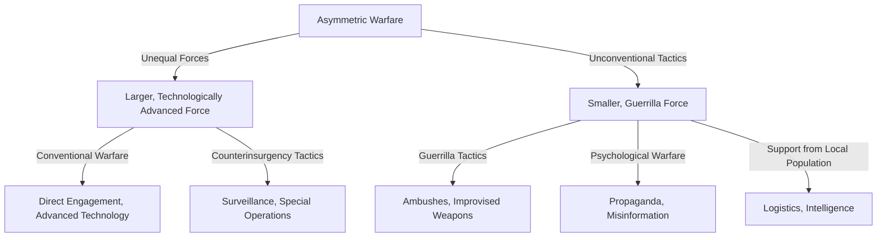

# [Asymmetric Warfare](https://en.wikipedia.org/wiki/Asymmetric_warfare)

- The asymmetry model leads to an application in warfare whereby one side seemingly “plays by different rules” than the other side due to circumstance. 
- This model is applied by an insurgency with limited resources. 
- Unable to out-muscle their opponents, asymmetric fighters use other tactics, as with terrorism creating fear that's disproportionate to their actual destructive ability.

!!! example "Example of Asymmetric Warfare"
    In the Vietnam War, where the Viet Cong used guerrilla tactics against the technologically superior U.S. forces.