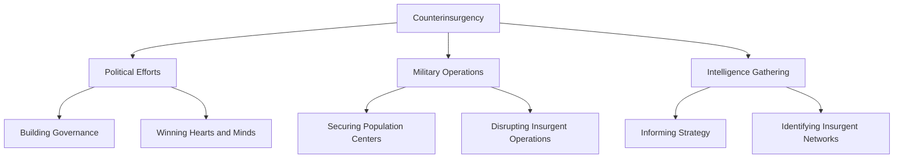

# [Counter Insurgency](https://en.wikipedia.org/wiki/Counterinsurgency)

- Though asymmetric insurgent warfare can be extremely effective, over time competitors have also developed counterinsurgency strategies. 
- Recently and famously, [General David Petraeus](https://en.wikipedia.org/wiki/David_Petraeus) of the United States led the development of counterinsurgency plans that involved no additional force but substantial additional gains. 
- Competition will often lead to a feedback loop that demands insurgency and counterinsurgency.

!!! example "Example of Counter Insurgency"
    The [U.S. military's surge in Iraq in 2007](https://en.wikipedia.org/wiki/Iraq_War_troop_surge_of_2007#:~:text=The%20Iraq%20War%20troop%20surge,Baghdad%20and%20Al%20Anbar%20Governorate.), which involved increased troop deployment and a strategy shift to secure population centers and gain the trust of local communities, is a real-life example of counterinsurgency.