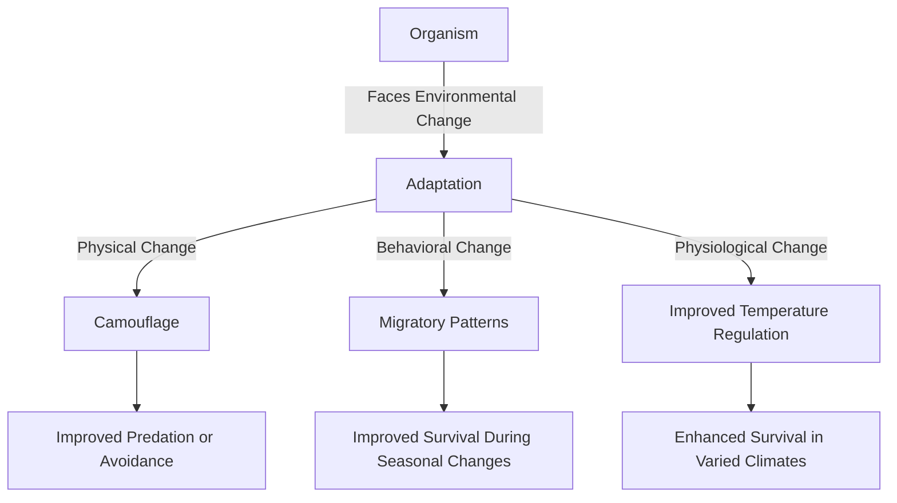

# [Adaptation](https://en.wikipedia.org/wiki/Adaptation)

- Species tend to adapt to their surroundings in order to survive, given the combination of their genetics and their environment – an always-unavoidable combination. 

- Adaptations made in an individual's lifetime are not passed down genetically, as was once thought: Populations of species adapt through the process of evolution by natural selection, as the most-fit examples of the species replicate at an above-average rate.

!!! example "Example of Adaptation"
    Certain species of frogs have developed the ability to change their [skin color](https://en.wikipedia.org/wiki/Frog_Skin) to blend in with their environment as a form of camouflage, a classic example of biological adaptation.

