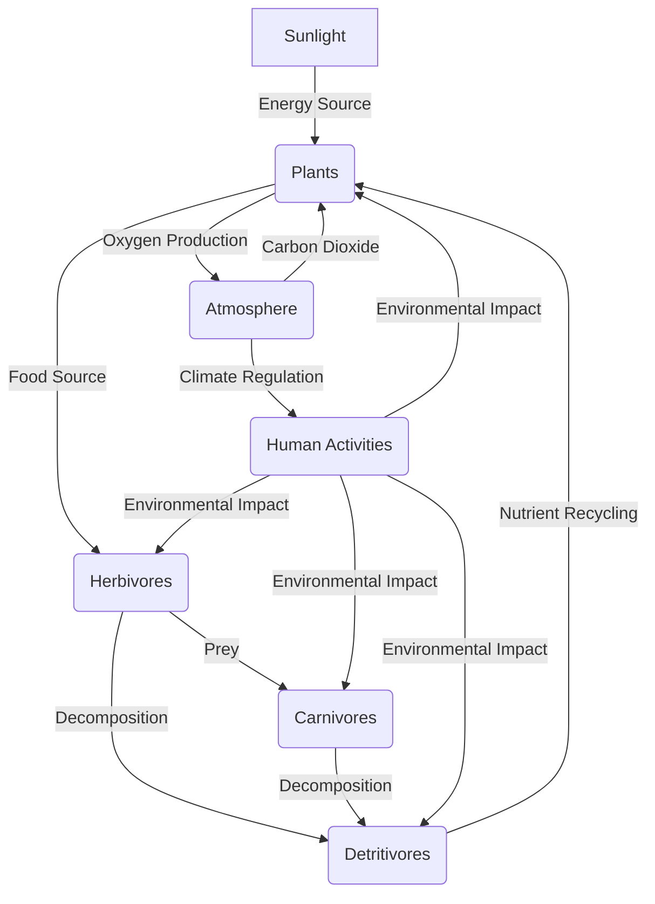

# [Ecosystems](https://en.wikipedia.org/wiki/Ecosystem)

- An ecosystem describes any group of organisms coexisting with the natural world. 
- Most ecosystems show diverse forms of life taking on different approaches to survival, with such pressures leading to varying behavior. 
- Social systems can be seen in the same light as the physical ecosystems and many of the same conclusions can be made.

!!! example "Example of Ecosystems"
    [Amazon Rainforest](https://en.wikipedia.org/wiki/Amazon_rainforest), hosting a diverse range of flora and fauna and playing a critical role in the Earth's climate system.