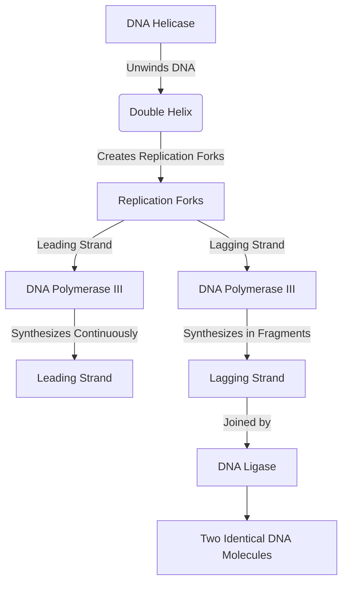

# [Replication](https://en.wikipedia.org/wiki/Self-replication)

- A fundamental building block of diverse biological life is high-fidelity replication. 
- The fundamental unit of replication seems to be the DNA molecule, which provides a blueprint for the offspring to be built from physical building blocks. 
- There are a variety of replication methods, but most can be lumped into sexual and asexual.

!!! example "Example of Replication"
    The process of [DNA replication](https://en.wikipedia.org/wiki/DNA_replication) in cells, where a cell duplicates its DNA before cell division.