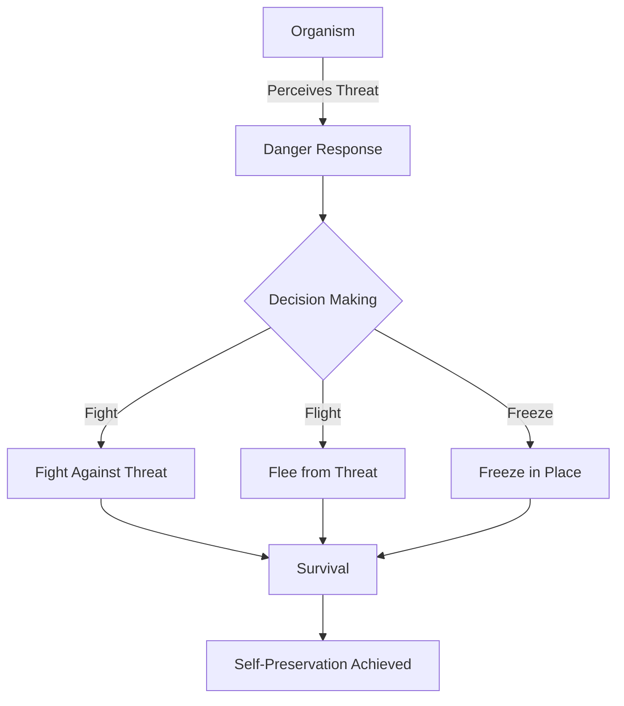

# [Self Preservation](https://en.wikipedia.org/wiki/Self-preservation)

- Without a strong self-preservation instinct in an organism’s DNA, it would tend to disappear over time, thus eliminating that DNA. 
- While cooperation is another important model, the self-preservation instinct is strong in all organisms and can cause violent, erratic, and/or destructive behavior for those around them.

!!! example "Example of Self Preservation"
    A mother bear fiercely protecting her cubs from predators is a real-life example of biological self-preservation.

