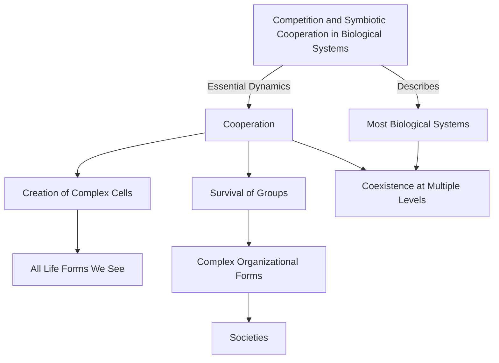

# [Symbiosis](https://en.wikipedia.org/wiki/Symbiosis)

- Competition tends to describe most biological systems, but cooperation at various levels is just as important a dynamic. 
- The cooperation of a bacterium and a simple cell probably created the first complex cell and all of the life we see around us. 
- Without cooperation, no group survives, and the cooperation of groups gives rise to even more complex versions of organization eg. [A society](https://en.wikipedia.org/wiki/Society). 
- Cooperation and competition tend to coexist at multiple levels.

!!! Example "Example of sysmbiosis"
    In a modern economy, businesses often engage in both cooperation and competition within a complex ecosystem: