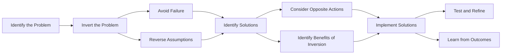

# [Inversion](https://en.wikipedia.org/wiki/Inverse_problem#Conceptual_understanding)

- Inversion is a problem-solving technique known as thinking through a situation in reverse or thinking “backwards".
- Optimising by what we want to avoid rather than what we want to get, we derive better solutions. 
- Inversion works not just in mathematics but in nearly every area of life. 

!!! Example 
    “Just tell me where I’m going to die so I can never go there." - MK Chong