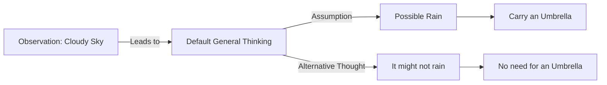

# [Default Thinking](https://en.wikipedia.org/wiki/Default)

- The USCB economist [Garrett Hardin](https://en.wikipedia.org/wiki/Garrett_Hardin) once said that “The scientific mind is not closed: it is merely well-guarded by a conscientious and seldom sleeping gatekeeper.” 
- The way it does that is with the concept of the default status: The “[resting position](https://en.wikipedia.org/wiki/Resting_position)” of common sense, whereby the burden of proof falls on assertions to the contrary. 
- Given the problem of opportunity costs and limited time and energy, a default status is nearly always necessary to avoid wasting time. Examples include the laws of thermodynamics, the law of natural selection, and the incentive-caused bias.

!!! example "Example of Default Thinking"
    Assuming it will rain because it's cloudy outside