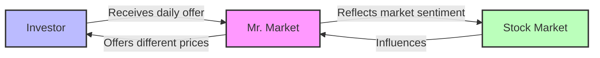

# [Mr Market](https://en.wikipedia.org/wiki/Mr._Market)

- Mr. Market was introduced by the investor [Benjamin Graham](https://en.wikipedia.org/wiki/Benjamin_Graham) in his seminal book [The Intelligent Investor](https://en.wikipedia.org/wiki/The_Intelligent_Investor) to represent the vicissitudes of the [financial markets](https://en.wikipedia.org/wiki/Financial_market). 
- Graham explains, the markets are a bit like a moody neighbor, sometimes waking up happy and sometimes waking up sad – your job as an investor is to take advantage of him in his bad moods and sell to him in his good moods. 
- This attitude is contrasted to an [efficient-market hypothesis](https://en.wikipedia.org/wiki/Efficient-market_hypothesis) in which Mr. Market always wakes up in the middle of the bed, never feeling overly strong in either direction.

!!! example "Example of Mr Market"
    An investor receives daily offers to buy or sell shares at fluctuating prices, mirroring the stock market's volatile nature and the changing sentiment of investors.