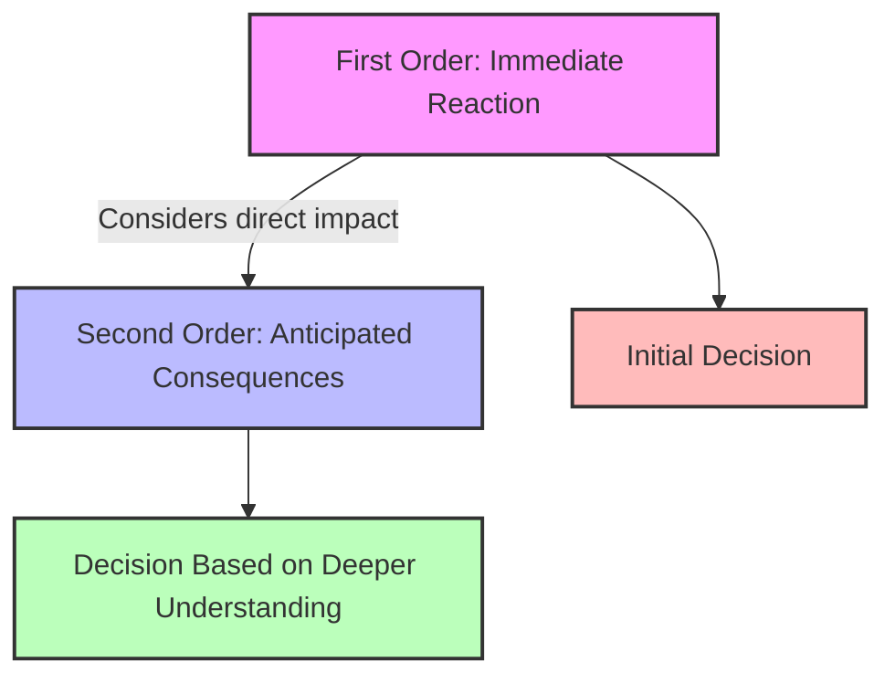

# [Second Order Thinking](https://neilkakkar.com/second-order-thinking.html)

- In all human systems and most complex systems, the second layer of effects often dwarfs the first layer, yet often goes unconsidered, we must consider that effects have effects. 
- Second-order thinking is best illustrated by the idea of standing on your tiptoes at a parade: Once one person does it, everyone will do it in order to see, thus negating the first tiptoer. Now, however, the whole parade audience suffers on their toes rather than standing firmly on their whole feet.

!!! example "Example of Second Order Thinking"
    Second-order thinking in real life could be choosing not to buy a popular stock because you anticipate that others will soon sell it, thus causing its value to drop.