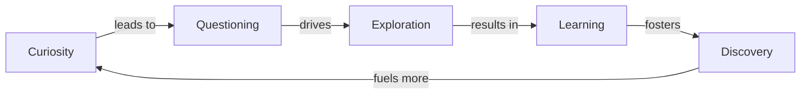

# [Curiousity](https://en.wikipedia.org/wiki/Curiosity)

- We like to call other species curious, but we are the most curious of all, an instinct which led us out of the [savanna](https://en.wikipedia.org/wiki/Savanna) and led us to learn a great deal about the world around us, using that information to create the world in our collective minds. 
- The curiosity instinct leads to unique human behavior and forms of organization like the scientific enterprise. Even before there were direct incentives to innovate, humans innovated out of curiosity.

!!! example "Example of Curiosity"
    Jane's eyes sparkled with curiosity as she peered through the telescope, eager to uncover the mysteries of the distant stars.