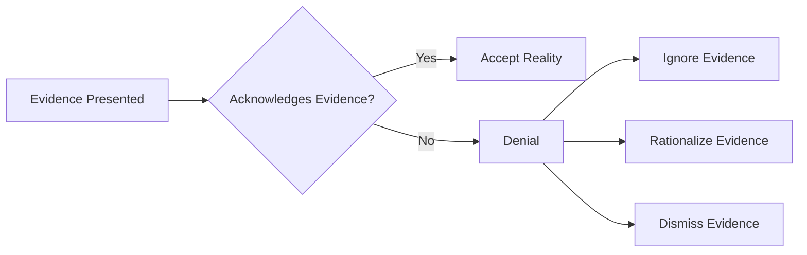

# [Denial](https://en.wikipedia.org/wiki/Denial)

- Anyone who has been alive long enough realizes that, as the saying goes, “denial is not just a river in Africa.” 
- This is powerfully demonstrated in situations like war or drug abuse, where denial has powerful destructive effects but allows for [behavioral inertia](https://en.wikipedia.org/wiki/Cognitive_inertia). 
- Denying reality can be a coping mechanism, a [survival mechanism](https://en.wikipedia.org/wiki/Anti-predator_adaptation), or a purposeful tactic.

!!! example "Example of Denial"
    Despite overwhelming evidence of climate change, many people still deny its existence, insisting that the unusual weather patterns are just a part of natural cycles.
