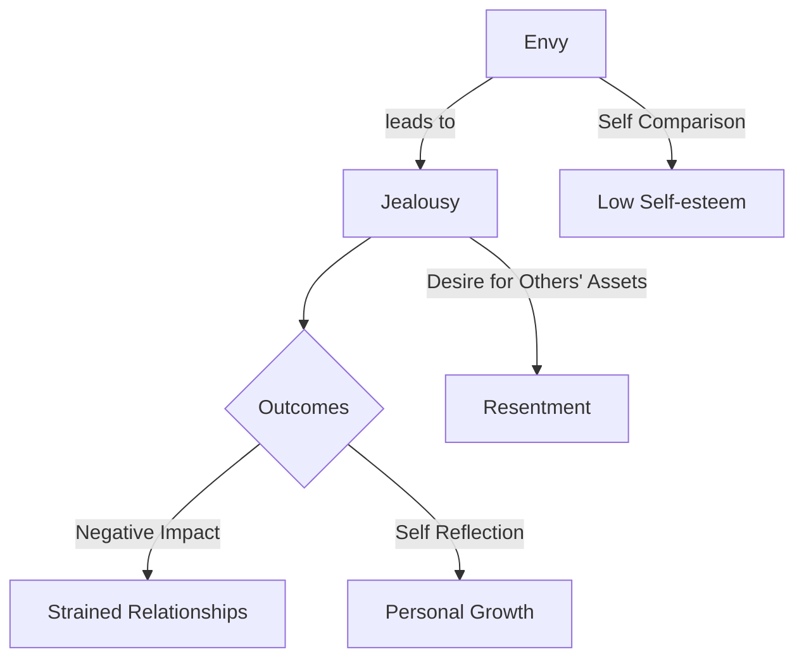

# [Envy and Jealousy](https://en.wikipedia.org/wiki/Jealousy)

- Humans have a tendency to feel envious of those receiving more than they are, and a desire “get what is theirs” in due course. 
- The tendency towards envy is strong enough to drive otherwise irrational behavior, but is as old as humanity itself. 
- Any system ignorant of envy effects will tend to self-immolate over time.

!!! example "Example of Envy and Jealousy"
    Jessica couldn't hide her jealousy when Bob received praise and recognition for his achievements.
