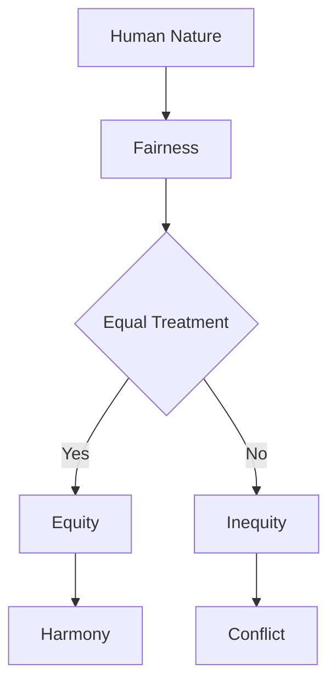

# [Fairness](https://en.wikipedia.org/wiki/Justice)

- Justice runs deep in our veins. 
- In another illustration of our relative sense of well-being, we are careful arbiters of what is fair. 
- Violations of fairness can be considered grounds for [reciprocal action](https://en.wikipedia.org/wiki/Reciprocity_(social_psychology)), or at least distrust. 
- Yet fairness itself seems to be a moving target. What is seen as fair and just in one time and place may not be in another. 
- Consider that slavery has been seen as perfectly natural and perfectly unnatural in alternating phases of human existence.

!!! example "Example of Fairness"
    The teacher demonstrated fairness by giving every student an equal opportunity to present their project.