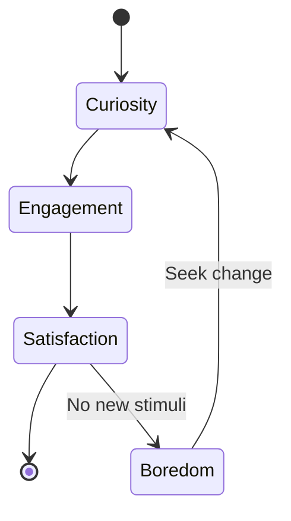

# [Tendency to do Something](https://en.wikipedia.org/wiki/Boredom)

- We might term this Boredom Syndrome: Most humans have the tendency to need to act, even when their actions are not needed. 
- We also tend to offer solutions even when we do not enough knowledge to solve the problem.

!!! example "Example of Tendency to do Something"
    The monotony of the long drive caused an overwhelming sense of boredom in him.