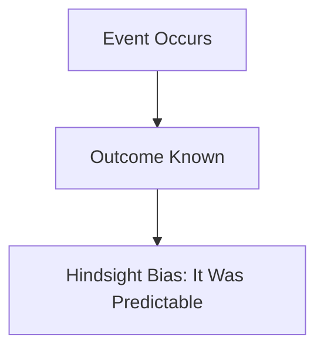

# [Hindsight Bias](https://en.wikipedia.org/wiki/Hindsight_bias)

- Once we know the outcome, it’s nearly impossible to turn back the clock mentally. 
- Our narrative instinct leads us to reason that we knew it all along (whatever “it” is), when in fact we are often simply reasoning post-hoc with information not available to us before the event. 
- The hindsight bias explains why it’s wise to keep a journal of important decisions for an unaltered record and to re-examine our beliefs when we convince ourselves that we knew it all along.

!!! example "Example of Hindsight Bias"
    Looking back, it seems obvious that investing in technology stocks was a bad idea during the dot-com bubble, but at the time, many people believed they were a surefire way to get rich.
