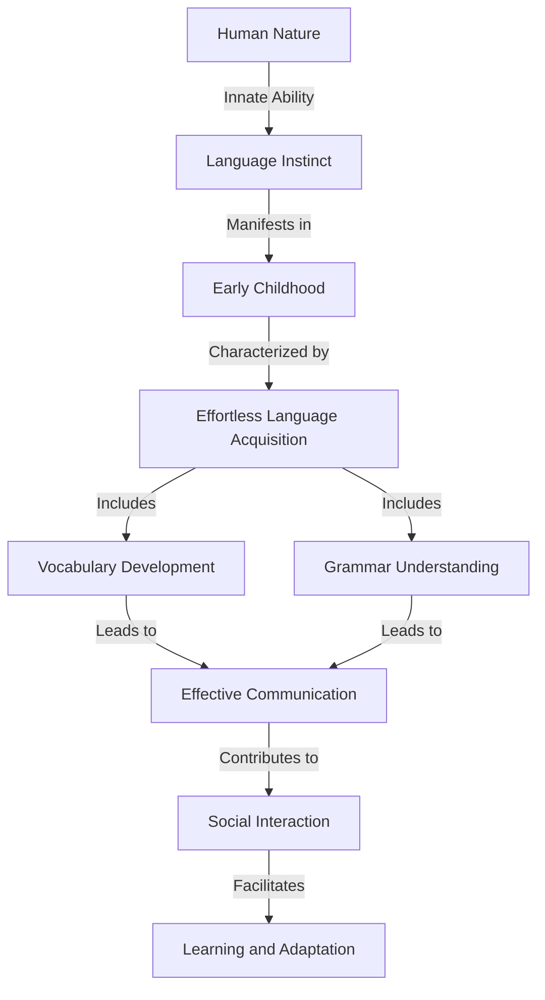

# [Language Instinct](https://en.wikipedia.org/wiki/Language)

- The psychologist Steven Pinker calls our DNA-level instinct to learn grammatically constructed language the Language Instinct. 
- The idea that grammatical language is not a simple cultural artifact was first popularized by the linguist [Noam Chomsky](https://en.wikipedia.org/wiki/Noam_Chomsky). 
- As we saw with the narrative instinct, we use these instincts to create shared stories, as well as to gossip, solve problems, and fight, among other things. Grammatically ordered language theoretically carries infinite varying meaning.

!!! example "Example of Language Instinct"
    Even as a toddler, Mia displayed a remarkable language instinct, effortlessly acquiring new words and grammatical structures, a testament to the innate human capacity for language.
