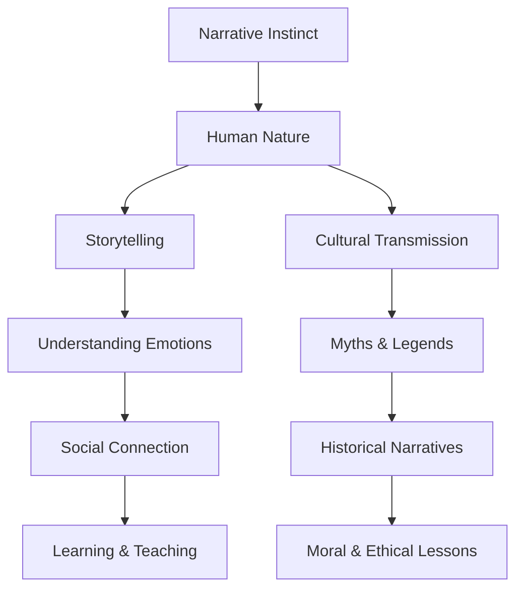

# [Narrative](https://en.wikipedia.org/wiki/Narrative)

- Human beings have been appropriately called “the storytelling animal” because of our instinct to construct and seek meaning in narrative. 
- It’s likely that long before we developed the ability to write or to create objects, we were telling stories and thinking in stories. 
- Nearly all social organizations, from religious institutions to corporations to [nation-states](https://en.wikipedia.org/wiki/Nation_state), run on constructions of the narrative instinct.

!!! example "Example of Narrative Instinct"
    Even as a child, Jane's narrative instinct was evident in the way she wove intricate stories from her everyday experiences, instinctively understanding the power of a well-told tale.