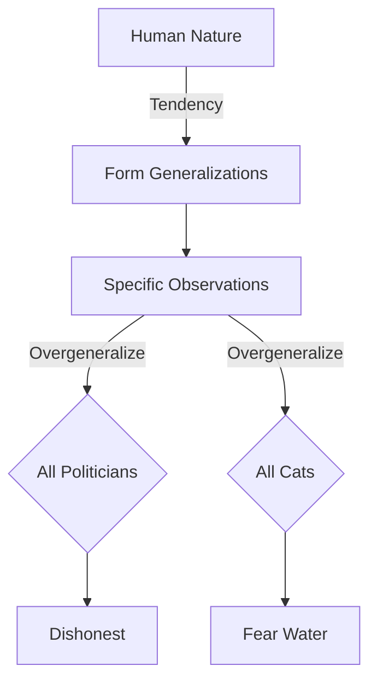

# [Over Generalization](https://en.wikipedia.org/wiki/Faulty_generalization#Hasty_generalization)

- It’s important for human beings to generalize; we need not see every instance to understand the general rule, and this works to our advantage. 
- With generalizing, however, comes a subset of errors when we forget about the [Law of Large Numbers](https://en.wikipedia.org/wiki/Law_of_large_numbers) and act as if it does not exist. 
- We take a small number of instances and create a general category, even if we have no statistically sound basis for the conclusion.

!!! example "Example of Over Generalization"
    All politicians are dishonest." This statement makes a sweeping generalization about an entire group based on limited information or stereotypes, which is characteristic of overgeneralization.

