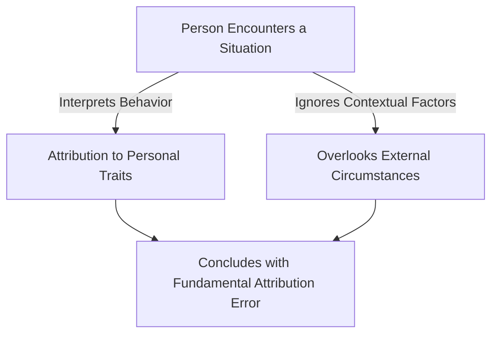

# [Fundamental Attribution Error](https://en.wikipedia.org/wiki/Intraclass_correlation)

- We tend to over-ascribe the behavior of others to their innate traits rather than to situational factors, leading us to overestimate how consistent that behavior will be in the future. 
- In such a situation, predicting behavior seems not very difficult. 
- Of course, in practice this assumption is consistently demonstrated to be wrong, and we are consequently surprised when others do not act in accordance with the “innate” traits we’ve endowed them with.

!!! example "Example of Fundamental Attribution Error"
    When John arrived late to the meeting, his colleagues immediately assumed he was always disorganized and irresponsible, without considering the heavy traffic that delayed him.