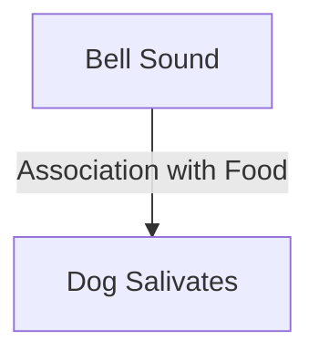

# [Pavlovian Association](https://en.wikipedia.org/wiki/Classical_conditioning)

- [Ivan Pavlov](https://en.wikipedia.org/wiki/Ivan_Pavlov) very effectively demonstrated that animals can respond not just to direct incentives but also to associated objects; remember the famous dogs salivating at the ring of a bell. 
- Human beings are much the same and can feel positive and negative emotion towards intangible objects, with the emotion coming from past associations rather than direct effects.

!!! Example "Example of Pavlovian Association"
    Every time a bell rings, a dog starts to salivate because it has learned to associate the sound of the bell with being fed.