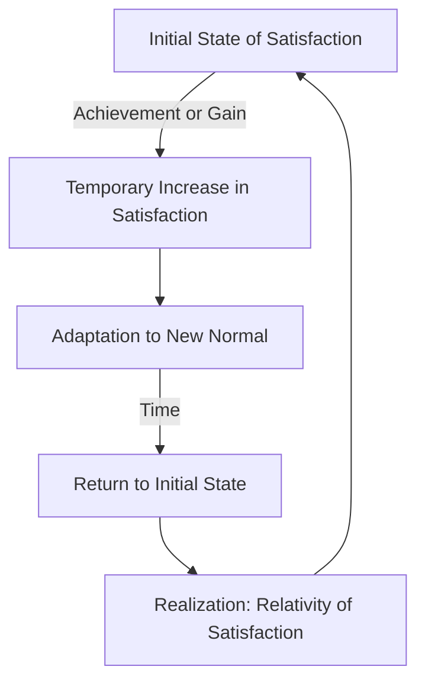

# [Relativity of Satisfaction](https://en.wikipedia.org/wiki/Numerical_relativity)

- The envy tendency is probably the most obvious manifestation of the relative satisfaction tendency, but nearly all studies of human happiness show that it is related to the state of the person relative to either their past or their peers, not absolute. 
- These relative tendencies cause us great [misery](https://en.wiktionary.org/wiki/misery) or [happiness](https://en.wikipedia.org/wiki/Happiness) in a very wide variety of objectively different situations and make us poor predictors of our own behavior and feelings.

!!! example "Example of Relativity of Satisfaction"
    Even after winning the lottery and buying a luxurious villa, Jane found her happiness short-lived, illustrating the relativity of satisfaction as she soon returned to her usual level of contentment.
