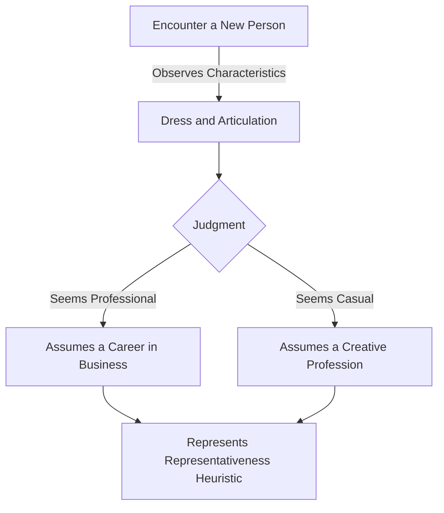

# [Representativeness Heuristic](https://en.wikipedia.org/wiki/Representativeness_heuristic)

- The three major psychological findings that fall under Representativeness, also defined by [Kahneman](https://en.wikipedia.org/wiki/Daniel_Kahneman) and his partner Tversky, are:
    - Failure to Account for Base Rates
    - An unconscious failure to look at past odds in determining current or future behavior.
    - Tendency to Stereotype
    - The tendency to broadly generalize and categorize rather than look for specific nuance. Like availability, this is generally a necessary trait for energy-saving in the brain.
    - Failure to See [False Conjunctions](https://en.wikipedia.org/wiki/Logical_conjunction)

- Most famously demonstrated by the Linda Test, the same two psychologists showed that students chose more vividly described individuals as more likely to fit into a predefined category than individuals with broader, more inclusive, but less vivid descriptions, even if the vivid example was a mere subset of the more inclusive set. 
- These specific examples are seen as more representative of the category than those with the broader but vaguer descriptions, in violation of logic and probability.

!!! example "Example of Representativeness Heuristic"
    When John met Sarah, a well-dressed, articulate person at a finance conference, he immediately assumed she was a successful investor, illustrating the representativeness heuristic where people judge the probability of an event by how much it resembles typical characteristics of similar events