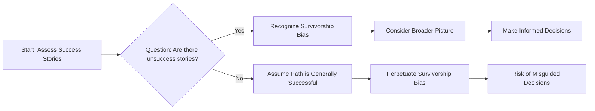

# [Survivaship Bias](https://en.wikipedia.org/wiki/Survivorship_bias)

- A major problem with [historiography](https://en.wikipedia.org/wiki/Historiography) – our interpretation of the past – is that history is famously written by the victors. 
- We do not see what [Nassim Taleb](https://en.wikipedia.org/wiki/Nassim_Nicholas_Taleb) calls the “silent grave” – the lottery ticket holders who did not win. 
- Thus, we over-attribute success to things done by the successful agent rather than to [randomness](https://en.wikipedia.org/wiki/Randomness) or luck, and we often learn false lessons by exclusively studying victors without seeing all of the accompanying losers who acted in the same way but were not lucky enough to succeed.

!!! example "Example of Survivaship Bias"
    The CEO's advice to drop out of college and start a business, citing his own success story, is a classic example of survivorship bias, as it ignores the many who took the same path and failed.