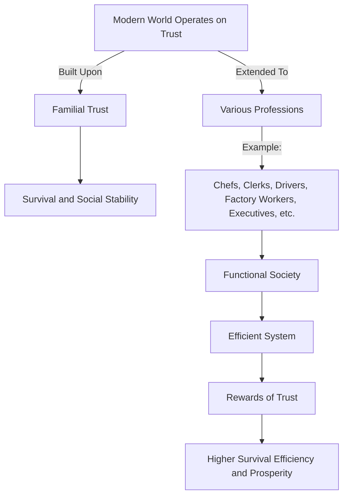

# [Trust](https://en.wikipedia.org/wiki/Trust_(social_science))

- Fundamentally, the modern world operates on trust. 
- Familial trust is generally a given (otherwise we’d have a hell of a time surviving)
- We also choose to trust chefs, clerks, drivers, factory workers, executives, and many others [professions](https://en.wikipedia.org/wiki/Profession). 
- A trusting system is one that tends to work most efficiently; the rewards of trust are extremely high.

!!! example "Trust Example"
    In modern society trust underpins our dining experience, from our fundamental trust in food safety to trusting chefs and restaurant workers.