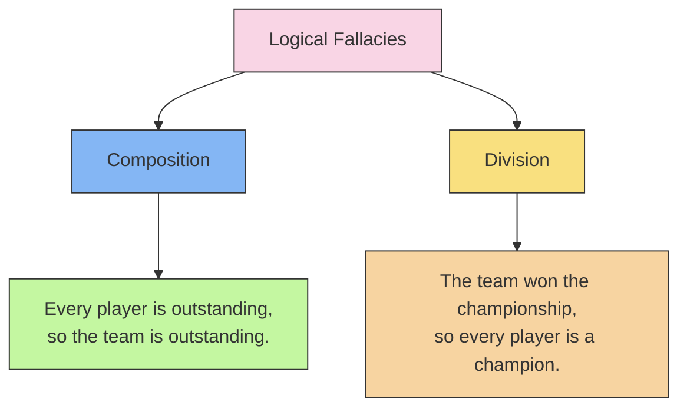

# [Composition and Divison](https://en.wikipedia.org/wiki/Structuralism)

- Assuming that one part of something has to be applied to all, or other, parts of it; or that the whole must apply to its parts.

- Often when something is true for the part it does also apply to the whole, or vice versa, but the crucial difference is whether there exists good evidence to show that this is the case. 

- We observe [consistencies](https://en.wikipedia.org/wiki/Consistency) in things, our thinking can become [biased](https://en.wikipedia.org/wiki/Bias_(disambiguation)) so that we presume consistency to exist where it does not.

!!! Example "Example of Composition and Division"
    Every player on the team is outstanding, so the team must be outstanding.
