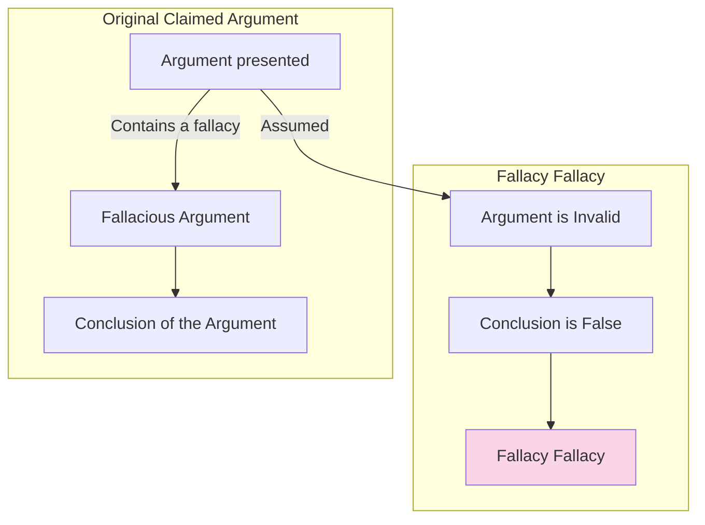

# [The Fallacy Fallacy](https://philarchive.org/archive/ABETFF-2)

- Assuming that because a claim has been poorly argued, or a fallacy has been made, that the claim itself must be wrong.
- It's possible to make a claim that is false yet argue with logical coherency for that claim, just as it's possible to make a claim that is true and justify it with other fallacies and poor arguments.

!!! Example "Fallacy Fallacy Example"
    Recognising that Chloe had committed a fallacy in arguing that we should eat healthy food because a nutritionist said it was popular, Jamie Oliver said we should therefore double cheeseburgers every day.
