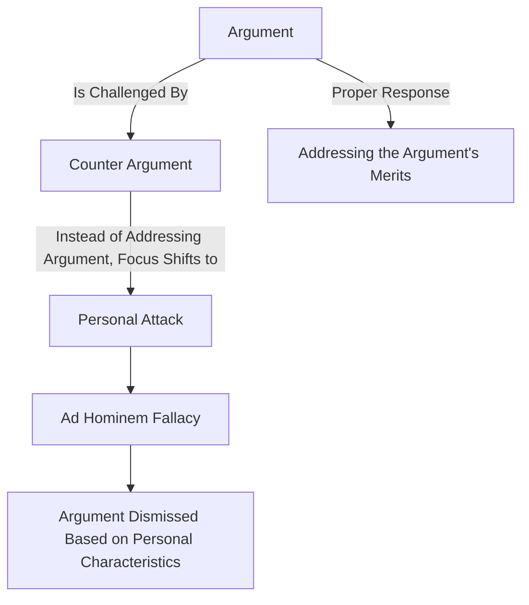

# [Ad Hominem](https://en.wikipedia.org/wiki/Ad_hominem)

- Attacking your opponent's character or personal traits in an attempt to undermine their argument.
- Ad hominem attacks can take the form of overtly attacking somebody, or more subtly casting doubt on their character or personal attributes as a way to discredit their argument. 
- The result of an ad hom attack can be to undermine someone's case without actually having to engage with it.

!!! example "Example of Ad Hominem"
    You're not qualified to talk about environmental issues because you drive a gas-guzzling car.