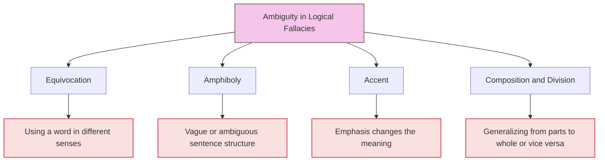

# [Ambiguity](https://en.wikipedia.org/wiki/Ambiguity)

- Using a double meaning or ambiguity of language to mislead or misrepresent the truth.
- Politicians are often guilty of using ambiguity to mislead and will later point to how they were technically not outright lying if they come under [scrutiny](https://en.wikipedia.org/wiki/Scrutiny). 
- The reason that it qualifies as a fallacy is that it is intrinsically misleading.

!!! example "Example of Ambiquity"
    "I saw the man with the telescope." This sentence is ambiguous because it can be interpreted in two ways: either the speaker used a telescope to see the man, or the man they saw was holding a telescope.