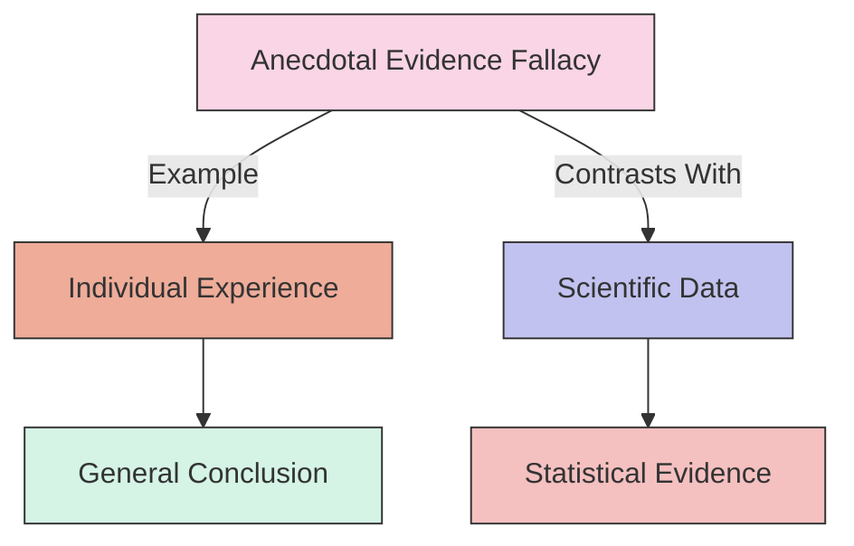

# [Anecdotal Evidence](https://en.wikipedia.org/wiki/Anecdotal_evidence)

- Using a personal experience or an isolated example instead of a sound argument or compelling [evidence](https://en.wikipedia.org/wiki/Evidence).

- It's often much easier for people to believe someone's testimony as opposed to understanding complex data and variation across a continuum. 

- [Quantitative scientific](https://en.wikipedia.org/wiki/Quantitative_research) measures are almost always more accurate than personal perceptions and experiences, but our inclination is to believe that which is tangible to us, and/or the word of someone we trust over a more 'abstract' statistical reality.

!!! example "Example of Anecdotal Evidence"
    "My grandfather smoked a pack of cigarettes a day and lived until 95, so smoking can't be that bad for you."