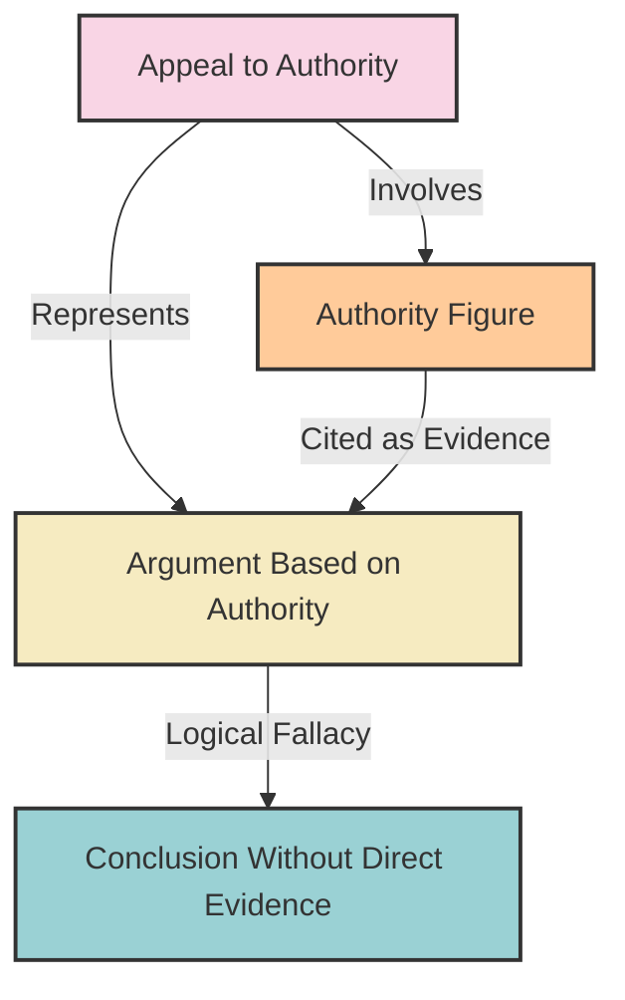

# [Appeal to Authority](https://en.wikipedia.org/wiki/Argument_from_authority)

- Saying that because an authority thinks something, it must therefore be true.
- It's important to note that this fallacy should not be used to dismiss the claims of experts, or [scientific consensus](https://en.wikipedia.org/wiki/Scientific_consensus). 
- Appeals to authority are not valid arguments, but nor is it reasonable to disregard the claims of experts who have a demonstrated depth of knowledge unless one has a similar level of understanding and/or access to [empirical evidence](https://en.wikipedia.org/wiki/Empirical_evidence). 
- It is entirely possible that the opinion of a person or [institution](https://en.wikipedia.org/wiki/Institution) of authority is wrong; therefore the authority that such a person or institution holds does not have any intrinsic bearing upon whether their claims are true or not.

!!! example "Example of Appeal to Authority"
    Dr. Smith, a renowned physicist, states that consuming more antioxidants improves brain function, so it must be true.