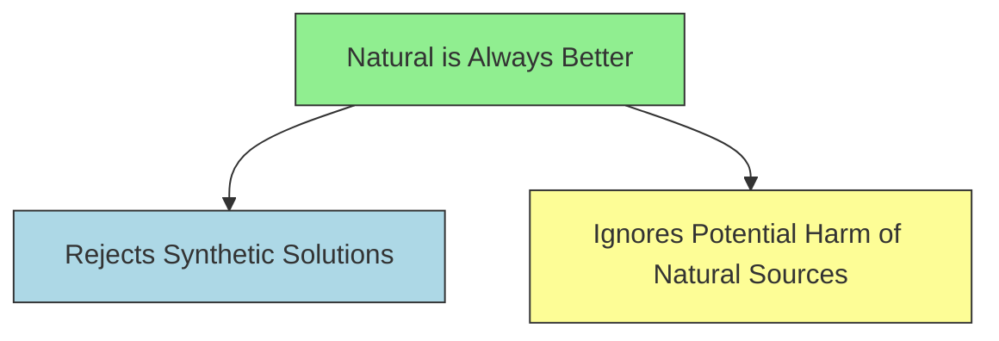

# [Appeal to Nature](https://en.wikipedia.org/wiki/Appeal_to_nature)

- Arguing that because something is '[natural](https://en.wikipedia.org/wiki/Nature)' it is therefore valid, justified, inevitable, good or ideal.
- Many 'natural' things are also considered 'good', and this can [bias](https://en.wikipedia.org/wiki/Bias) our thinking; but naturalness itself doesn't make something good or bad. 
- For instance murder could be seen as very natural, but that doesn't mean it's good or justifiable.

!!! example "Example of Appeal to Nature"
    Natural remedies are always better than synthetic medicines because they are from nature.