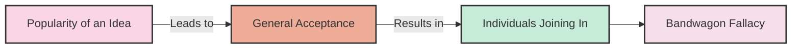

# [Bandwagon](https://en.wikipedia.org/wiki/Bandwagon_effect)

- Appealing to popularity or the fact that many people do something as an attempted form of [validation](https://en.wikipedia.org/wiki/Normative_social_influence).
- The flaw in this argument is that the popularity of an idea has absolutely no bearing on its validity.
- If it did, then the Earth would have made itself flat for most of history to accommodate this popular belief.

!!! example "Example of Bandwagon"
    Many people are buying this smartphone just because it's popular; they're all jumping on the bandwagon.