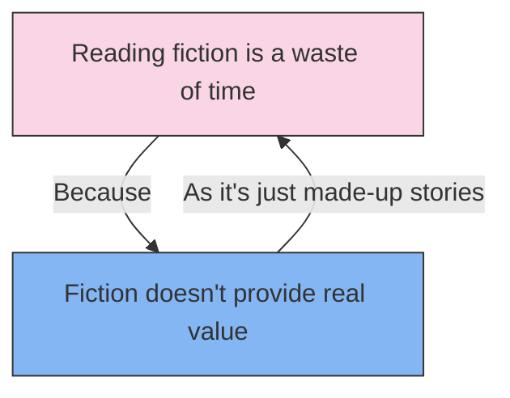

# [Begging the Question](https://en.wikipedia.org/wiki/Begging_the_question)

- Presenting a [circular argument](https://en.wikipedia.org/wiki/Circular_reasoning) in which the conclusion was included in the premise.
- This logically incoherent argument often arises in situations where people have an assumption that is very ingrained, and therefore taken in their minds as a given. 
- Circular reasoning is bad mostly because it's not very good.

!!! example "Example of Begging the Question"
    "Reading fiction is a waste of time because it doesn't provide any real value, as it's just made-up stories."