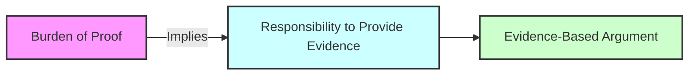

# [Burden of Proof](https://en.wikipedia.org/wiki/Burden_of_proof_(philosophy))

- Saying that the burden of proof lies not with the person making the claim, but with someone else to disprove.

- The burden of proof lies with someone who is making a claim, and is not upon anyone else to disprove. 

- The inability, or disinclination, to disprove a claim does not render that claim valid, nor give it any credence whatsoever. 

- It is important to note that we can never be certain of anything, and so we must assign value to any claim based on the available [evidence](https://en.wikipedia.org/wiki/Evidence), and to dismiss something on the basis that it hasn't been proven beyond all doubt is also [fallacious reasoning](https://en.wikipedia.org/wiki/Fallacy).

!!! example "Example of Burden of Proof"
    In a debate, the burden of proof lies with the person making a [claim](https://en.wikipedia.org/wiki/Claim_(philosophy)), requiring them to provide evidence to support their argument.