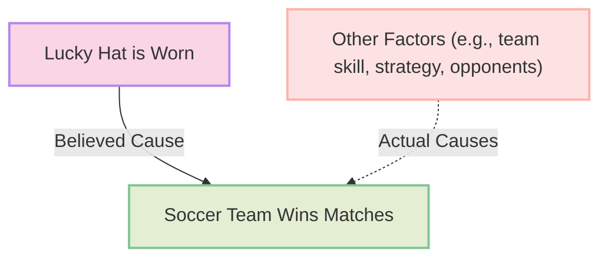

# [False Cause](https://en.wikipedia.org/wiki/Questionable_cause)

- Presuming that a real or perceived relationship between things means that one is the cause of the other.
- Many people confuse [correlation](https://en.wikipedia.org/wiki/Correlation) (things happening together or in sequence) for [causation](https://en.wikipedia.org/wiki/Causation_(law)) (that one thing actually causes the other to happen). Sometimes correlation is coincidental, or it may be attributable to a common cause.

!!! example "Example of False Cause"
    Pointing to a fancy chart, Roger shows how temperatures have been rising over the past few centuries, whilst at the same time the numbers of pirates have been decreasing; thus pirates cool the world and global warming is a hoax.