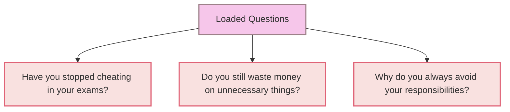

# [Loaded Question](https://en.wikipedia.org/wiki/Loaded_question)

- Asking a question that had a presumption built into it so that it couldn't be answered without appearing guilty.
- Loaded question fallacies are particularly effective at derailing rational debates because of their [inflammatory](https://en.wikipedia.org/wiki/Inflammatory) nature - the recipient of the loaded question is compelled to defend themselves and may appear flustered or on the back foot.

!!! example "Example of a Loaded Question"
    "Have you stopped cheating in your exams?" This question is loaded because it presupposes guilt regardless of the answer. If the person says "yes," it implies they previously cheated, and if they say "no," it implies they are still cheating.