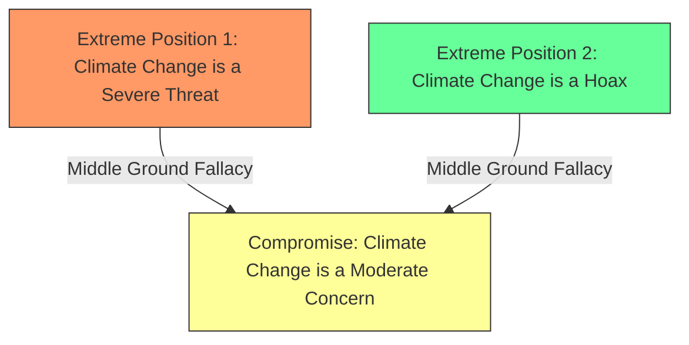

# [Middle Ground](https://en.wikipedia.org/wiki/Compromise)

- Claiming that a [compromise](https://en.wikipedia.org/wiki/Compromise), or middle point, between two extremes must be the truth.
- Much of the time the truth does indeed lie between two extreme points, but this can bias our thinking: sometimes a thing is simply untrue and a compromise of it is also untrue. Half way between truth and a lie, is still a lie.

!!! example "Example of Middle Ground Fallacy"
    An example of a middle ground fallacy in a sentence is: "Some people say that climate change is a severe threat needing immediate action, while others claim it is a hoax. Therefore, the truth must be that climate change is a moderate concern that requires some attention but not urgent action.