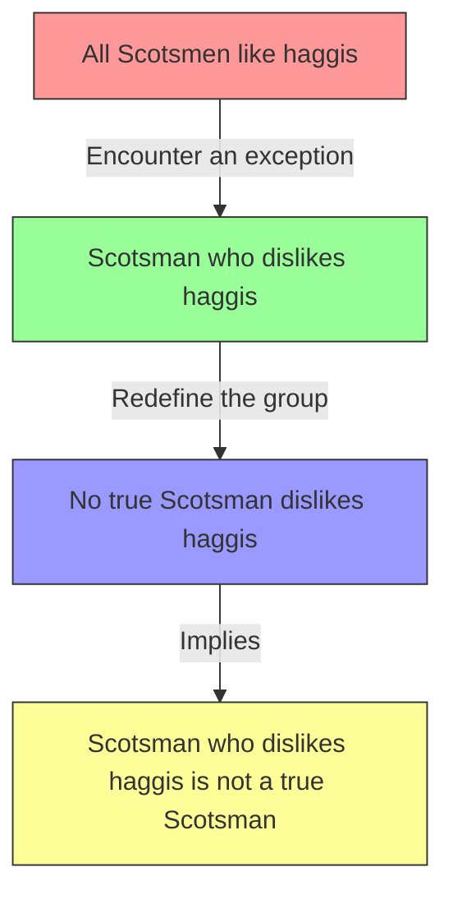

# [No True Scotsman](https://en.wikipedia.org/wiki/No_true_Scotsman)

- Making what could be called an [appeal to purity](https://en.wikipedia.org/wiki/No_true_Scotsman) as a way to dismiss relevant criticisms or flaws of your argument.

In this form of faulty reasoning one's belief is rendered [unfalsifiable](https://en.wikipedia.org/wiki/Falsifiability) because no matter how compelling the evidence is, one simply shifts the goalposts so that it wouldn't apply to a supposedly 'true' example. 

This kind of post-[rationalization](https://en.wikipedia.org/wiki/Rationalization) is a way of avoiding valid criticisms of one's argument.

!!! example "Example of No True Scotsman"
    "No true Scotsman would ever dislike [haggis](https://en.wikipedia.org/wiki/Haggis), and anyone claiming to be Scottish but disliking haggis must be from a different, lesser part of Scotland."