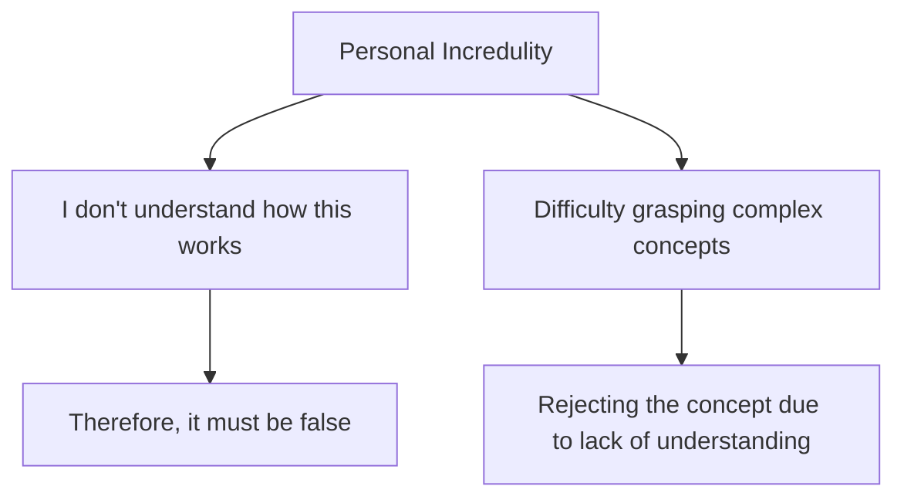

# [Personal Incredulity](https://en.wikipedia.org/wiki/Argument_from_ignorance)

- Because you found something difficult to understand, or are unaware of how it works, you make out like it's probably not true.
- Complex subjects like biological [evolution](https://en.wikipedia.org/wiki/Evolution) through [natural selection](https://en.wikipedia.org/wiki/Natural_selection) require some amount of understanding before one is able to make an informed judgement about the subject at hand; this fallacy is usually used in place of that understanding.

!!! example "Example of Personal Incredulity"
    "I can't understand how evolution could possibly result in such complex organisms, so it must be wrong."