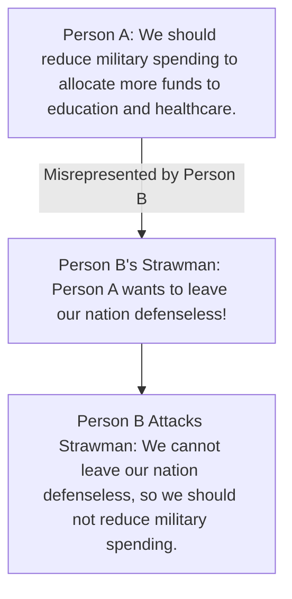

# [Strawman](https://en.wikipedia.org/wiki/Strawman_theory)

- Misrepresenting someone's argument to make it easier to attack.
- By exaggerating, misrepresenting, or just completely fabricating someone's argument, it's much easier to present your own position as being reasonable, but this kind of dishonesty serves to undermine honest rational debate.

!!! example "Example of Strawman"
    My opponent says we need to reduce military spending, but I think it's absurd to leave our nation defenseless against potential threats.