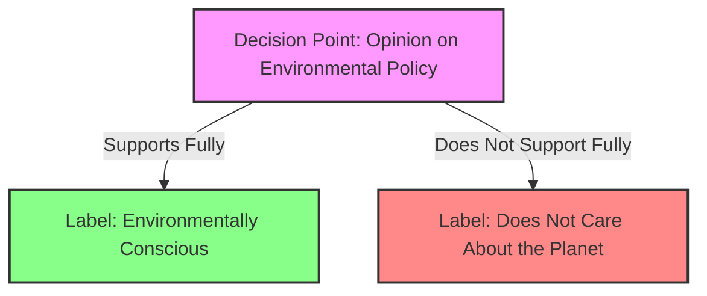

# [Black or White](https://en.wikipedia.org/wiki/False_dilemma)

- Presenting two alternative states as the only possibilities, when in fact more possibilities exist.

- Also known as the [false dilemma](https://en.wikipedia.org/wiki/False_dilemma), this insidious tactic has the appearance of forming a logical argument, but under closer scrutiny it becomes evident that there are more possibilities than the either/or choice that is presented. 

- [Binary](https://en.wikipedia.org/wiki/Binary_operation), black-or-white thinking doesn't allow for the many different variables, conditions, and contexts in which there would exist more than just the two possibilities put forth. 

- It frames the argument misleadingly and obscures rational, honest debate.

!!! example "Example of False Dilemma"
    You either support the new environmental policy completely, or you don't care about the planet at all.