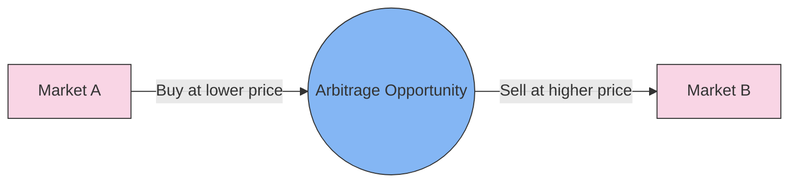

# [Arbitrage](https://en.wikipedia.org/wiki/Arbitrage)

- Given two markets selling an identical good, an arbitrage exists if the good can profitably be bought in one market and sold at a profit in the other. 

- This model is simple on its face, but can present itself in disguised forms: The only gas station in a 50-mile radius is also an arbitrage as it can buy gasoline and sell it at the desired profit (temporarily) without interference. 

- Nearly all arbitrage situations eventually disappear as they are discovered and exploited.

!!! example "Example of Arbitrage"
    She successfully conducted an arbitrage by buying gold in one market at a lower price and selling it in another market at a higher price, profiting from the price differential.