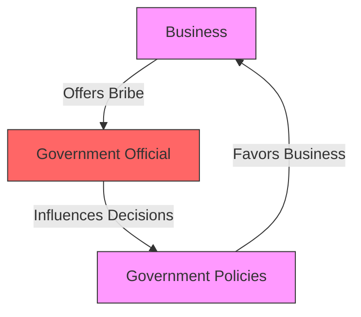

# [Bribery](https://en.wikipedia.org/wiki/Bribery)

- Often ignored in mainstream economics, the concept of bribery is central to human systems: Given the chance, it is often easier to pay a certain agent to look the other way than to follow the rules. 

- This principle/agent problem can be seen as a form of arbitrage.

!!! example "Example of Prisoner's Dilemma"
    The investigation revealed that the official had accepted bribery in exchange for favorable decisions, undermining the integrity of the office